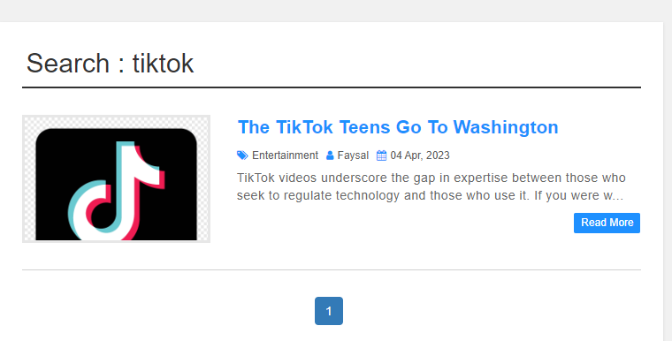

<!DOCTYPE html>
<html lang="en">
<head>
    <meta charset="UTF-8">
    <meta http-equiv="X-UA-Compatible" content="IE=edge">
    <meta name="viewport" content="width=device-width, initial-scale=1.0">
    <title>Document</title>
</head>
<body>
<h2> Here Are all details of my personal blog site</h2>

<h2>My Home Page</h2>

<h2>My Contact Page</h2>

<h2>After Searching any item</h2>

For doing this project i have faced some difficulties. as for deleting any data from sql i got some error. however i overcome through it

 
Another thing i got some error at searching and for login. however for login previous assignment help me a lot. 

</body>
</html>
